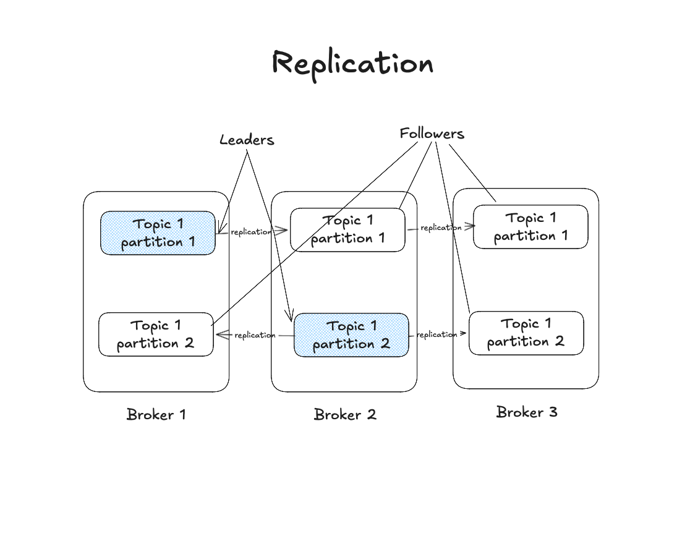

# Cluster

A Kafka cluster is a group of servers, brokes, or nodes that work together to manage the flow of data. If you need to add more processing power or storage, simply add a new cluster member. Partitions will automatically be distributed. If one broker fails, the cluster automatically recovers by activating the backup partitions, ensuring that no data is lost.

## High Availability and Durability

In a cluster, each broker or node is resonsible for storing part of the data, and the brokers work together to ensure that the data is available, durable, and distributed.

## Fault tolerance

Each broker in the cluster manages a set of topic partitions. These partitions allow data to be spread across different servers, which improves scalability and fault tolerance.

## Replication and retention policy

Replication ensures data availability and fault tolerance. The process consists of copying data across multiple brokers. This ensures data is not lost even if a broker fails.

Each partition is distributed across several brokers known as replicas. Among the replicas, one is designated as the leader while the others are followers. The leader is the only replica that can handle reads and writes. Followers handle replicating data from the leader. If the leader fails one of the followers is automatically promoted to be the new leader.

Replication is configured using the replications factor setting. This determines how many copies of each partition are maintained. A common replication factor is 3 which means there are 3 copies of each partition across different brokers.

Retention policies define how long data is stored before deleted. This can be configured per topic. The global default is 7 days or 168 hours.
